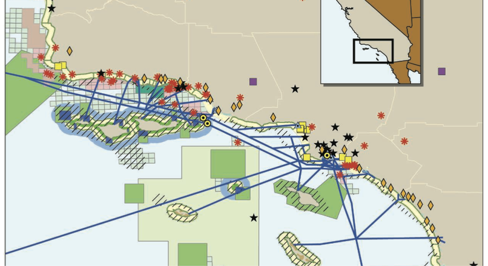

-   Abstract
-   Introduction
    -   Notes
-   Robust and Dynamic Distribution Models
-   Decision Mapping
    -   todo: Simulations
-   Probabilistic Range Maps
-   Conservation Routing
-   Predicting Seasonal Migration
-   Conclusion
-   Appendix
-   References

**Species Distribution Modeling and Spatial Decision Frameworks for Marine Megafauna**
Draft PhD dissertation by Benjamin D. Best
in Marine Science and Conservation, Duke University
Last modified: 2014-08-08

Abstract
========

Our ability to conserve and manage endangered species at sea is limited by our ability to predict species distributions. Herein I describe improvements on predicting distribution and abundance of species as well as decision frameworks for siting potentially harmful activities to times and places that minimize risk to the animals.

<!--- `source('make_config.R'); render_html('a_intro.Rmd')` # run for quick render -->
Introduction
============

<a name="fig_crowder_resolving_2006"></a>

 <br />
*Figure 1. Example from Crowder et al.(2006) of the many mixed uses of our oceans necessitating coordinated, holistic approaches to marine spatial management.*

Successful conservation of marine megafauna is dependent upon identifying times and places of greatest use, within the context of a changing climate and increasing array of human activities. Concurrent with a rise in conflicting human uses has been a rapid decline in overall marine biodiversity and ecosystem services (Butchart et al., 2010; B. S. Halpern et al., 2008b; Worm et al., 2006, 2009). In response, recent calls for holistic management practices, such as ecosystem-based management and marine spatial planning, are encouraging multi-species, multi-sector approaches (L. B. Crowder et al., 2006; L. Crowder & Norse, 2008; Dahl, Ehler, & Douvere, 2009; F. Douvere, 2008; M. M. Foley et al., 2010; B. S. Halpern, McLeod, Rosenberg, & Crowder, 2008a; Lubchenco & Sutley, 2010; US Commission on Ocean Policy, 2004) (see [Figure 1](#fig_crowder_resolving_2006)). For these applications I’ll be focusing on marine spatial planning of cetaceans, but methods will be transferable to other marine megafauna.

In the US, marine mammals are legally protected through the Marine Mammal Protection Act and 22 are listed as threatened or endangered so are covered by The Endangered Species Act. Human activities that pose threats include: fishing bycatch or prey depletion (A. J. Read, 2008), ship strikes (Laist, Knowlton, Mead, Collet, & Podesta, 2001), anthropogenic noise (Weilgart, 2007), pollution of oil or bioaccumulating contaminants (Aguilar, Borrell, & Reijnders, 2002; O’Shea & Brownell Jr., 1994; Ross, 2006), and global climate change (Alter, Simmonds, & Brandon, 2010; Learmonth et al., 2006). Relocating potentially harmful human activities away from known cetacean distributions is generally the safest and simplest way to minimize risk (S. J. Dolman, Weir, & Jasny, 2009; Redfern et al., 2006).

The current state of marine spatial planning begs several broad questions of decision makers and decision support scientists. How do you optimize use of ocean resources to provide long-term ecosystem services in a sustainable manner while minimizing impacts on endangered species? How much risk are you willing to accept? What are the tradeoffs between conservation value and economic impact? How do you handle poor data availability within marine systems? How do you manage the dynamic nature of the environment with species distributions? How do you handle uncertainty while making spatial decisions? Which human uses require custom applications?

While much work has been done already to support description of species distributions for planning purposes (J. Elith & Leathwick, 2009; Margules & Sarkar, 2007; Pressey & Bottrill, 2009; Pressey, Cabeza, Watts, Cowling, & Wilson, 2007), there is room for improvement in answering the questions above for adopting a marine operational framework.

Over the next 5 chapters I propose methods for addressing these questions within two study areas, British Columbia and US Atlantic (see .

1.  I start with pooling boat and plane datasets in order to incorporate more data into the species distribution models (SDMs). A variety of SDMs will be compared for their requirements, outputs and performance. Improvements in the SDMs will include novel environmental predictors, addressing scale and exploring lags in space and time.

2.  Decision Mapping provides a framework for incorporating uncertainty into decision making spatially.

3.  Seasonal Migrations explicitly includes time-varying habitats in SDMs.

4.  Probabilistic Range Maps combine range maps and occurrence through a Bayesian environmental model.

5.  In Conservation Routing layers of species data are combined into a single cost surface for routing ships using least cost paths. These tools should enable a more transparent, operational and robust set of methods for incorporating cetacean species distribution models into the marine spatial planning process.

Notes
-----

-   Titles to consider:
-   Data to Decisions: Applying Dynamic Species Distribution Models to Cetacean Conservation Management
-   Marine Spatial Planning for Megafauna in a Dynamic Ocean: Methods and Applications for the Future
-   

<!--- `source('make_config.R'); render_html('c_sdm.Rmd') # run for quick render` -->
Robust and Dynamic Distribution Models
======================================

Species distribution modeling literature and available techniques are vast (J. Elith & Leathwick, 2009). Predictive (vs explanatory) techniques are broadly divisible as regression, such as generalized linear model (GLM) or generalized additive model (GAM), or as machine learning, such as multiple adaptive regression splines (MARS), boosted regression trees (BRT), or maximum entropy (Maxent). MARS can uniquely produce a multi-species response allowing for pooling of data, especially helpful for rare species (Heinänen & Numers, 2009; J. Leathwick, Elith, & Hastie, 2006; Nally, Fleishman, Thomson, & Dobkin, 2008). Multiple models can be combined as an ensemble (Araujo & New, 2007). Output can predict likelihood of presence (i.e. habitat) or density (i.e. abundance per unit area). Some habitat modeling techniques (e.g. Maxent) require only presence data, whereas others require absence or pseudo-absence records. Density models require more information on group sizes and parameters for detectability. Density predictions enable the calculation of potential take, often required for environmental impact assessment. Habitat requires less data and may be more appropriate for determining go/no-go areas. Habitat has been correlated to density for cetaceans in Scotland waters, but inconsistently (Hall et al., 2010). Issues such as autocorrelation (Dormann et al., 2007) and sampling bias (Phillips et al., 2009) need to be addressed with each set of data.

Taking advantage of recently completed cetacean habitat models for US Atlantic waters (Best et al., 2012), I will compare performance of modeling techniques ranging from presence-only to presence-absence to density . These will include both correlative techniques (GLM, GAM) and machine learning (random forest, BRT, Maxent). Does more information as required by presence-absence and especially density add value? In order to use both ship and plane datasets the cell values for fitting the GAMs were offset residence time of survey effort per cell. No known methods exist to simultaneously incorporate density surface models from different platforms, so data will need to be subset for comparability. Measures such as AUC will assess model performance.

Megafauna often move between several habitats depending on life stage while exhibiting complex behaviors. They live in a dynamic world of shifting currents or winds, temperature and prey. This compounds typical data limitations, often resulting in species distributions having poor levels of variance explained. Inclusion of dynamic variables could improve predictability. The original models only included depth, distance to shore, distance to continental shelf break, and sea-surface temperature (SST). The next generation of models will include novel covariates from satellite-derived features which tend to aggregate prey: improved sea-surface temperature fronts, geostrophic eddies and the Lagrangian technique finite-size Lyapunov exponent (Tew Kai et al., 2009). Mixed layer depth (MLD) has proven to be a strong predictor for the habitat of some cetaceans (Redfern et al., 2006), but has historically been limited to in situ measurements by boat limiting its prediction across the seascape. Now 4D oceanographic models such as the Hybrid Coordinate Ocean Model (HyCOM) make MLD available over the entire oceanographically modeled extent. Oceanographic models also do not suffer from cloud cover and can resolve more finely in time and space, although error still exists. Most importantly they can be used to forecast conditions. California NOAA colleagues Elizabeth Becker and Karin Forney have been extending their models (Becker et al., 2010) with the Regional Oceanographic Modeling System (ROMS) to forecast in the Pacific. HYCOM currently predicts out 5 days and ROMS up to 3 months. Most of these data and tools relevant to US Atlantic are easily accessed within an ArcGIS workflow through the Marine Geospatial Ecology Tools[1] (Roberts, Best, Dunn, Treml, & Halpin, 2010).

Adaptive management practices are emerging for responding to real-time oceanographic features and endangered species observations. Hawaii-based longline vessels in the Pacific are advised by a regularly update satellite contour map from the TurtleWatch service[2] to fish in waters warmer than 65.5° C to avoid bycatch of loggerhead sea turtles (Howell, Kobayashi, Parker, Balazs, & Polovina, 2008). A similar temperature contour was used for separation of commercially fished tuna species in southwestern Australia (A. J. Hobday & Hartmann, 2006). All vessels larger than 65 ft around Boston Harbor must travel 10 knots or less in critical habitat areas, and those heavier than 300 gross tons must report entrance into key areas and respond in real-time to current observations delivered through the right whale sighting advisory system[3] (L. Ward-Geiger, Silber, Baumstark, & Pulfer, 2005). The notion of pelagic reserves (K. D. Hyrenbach, Forney, & Dayton, 2000) is still young and has been more recently suggested beyond countries' exclusive economic zones (Ardron, Gjerde, Pullen, & Tilot, 2008). The UN Convention on Biological Diversity is reviewing criteria for Ecological and Biological Significant Areas for applying these measures, organized in coordination with the Halpin lab through the Global Ocean Biodiversity Initiative[4]. In short a receptive audience awaits for determining pelagic habitats with the latest predictive tools relevant to policy in process (D. C. Dunn, Boustany, & Halpin, 2010).

Dynamic management can include time-area closures, response to environmental cues, and response to real-time observations. Whenever considering these measures, the question to be asked is how much added value does dynamic management provide in reducing risk versus cost for additional management complexity?

Scaling issues are pervasive in ecology (Wiens, 1989) and at least as relevant here. Grain of the satellite imagery or oceanographic model is the limiting factor for differentiating local behavior and response. For instance the geostrophic currents is at about a 9km resolution. Many smaller-scale oceanographic features exist relevant to species. From the minimal resolution raster layers could be scaled to larger grain sizes to evaluate the sensitivity and performance of the models at different scales. This can similarly be done in time. A tradeoff generally exists with finer temporal scales such as daily or weekly, suffering from more missing data due to cloud cover. Larger scales, such as annual or climatic, average out of existence significant ephemeral features like SST fronts or geostrophic eddies.

Distribution of a species can lag in time and space from the characterization of the environment, whether from remotely sensed data or oceanographic models. The degree to which one is coupled to the other may inform key ecological process, such as trophic linkages. For instance, zooplanktivorous baleen whales, like the right whale feeding on Calanus, are hypothesized to be respond more quickly and predictably to the environment than pisciverous whales since more time is allowed for drift. One study in South Africa boldly measured temperature, chlorophyll, zooplankton, fish, bigger fish and birds, and found a spatial mismatch in trophic linkages (Gremillet et al., 2008). Simple testing of this drift in time between species and environment could simply be accomplished by including lagged terms in the model and allowing model selection to determine the best lag. Spatial lag would test neighbors in space, hence testing 4 rook or 8 cardinal neighbors per cell.

<!--- `source('make_config.R'); render_html('c_siting.Rmd') # run for quick render` -->
Decision Mapping
================

Often in ecology our predictive models yield very uncertain estimates. Incorporating this uncertainty into the decision-making process is a challenge. Typically this error is never used in the planning process, just the mean prediction surface or a thresholded binary map based on cross-validation. Areas exhibiting a low mean prediction but high uncertainty could still be too risky for some human activities. Conversely, habitat predicted with high confidence is presumably riskier than those with less.

An elegant solution for incorporating risk into decision making is to use a loss function (Ellison, 1996; Shrader-Frechette & McCoy, 1993; B. L. Taylor, Wade, Stehn, & Cochrane, 1996; P. R. Wade, 2000). For different decision outcomes, loss functions multiply a loss factor over the integrated probability for the parameter of interest. The recommended decision is then the one that minimizes the loss. For instance, in order to decide whether to conduct an activity in an area which may be harmful to a species that has some probability of being present, two loss functions could be constructed reflecting a decision to: 1) “go” or 2) “no-go.” Each function is multiplied by the probabilities of each cell resulting in two surfaces representing the loss for each decision. The loss function for the “go” decision would reflect the loss associated with negatively impacting the species if present and conducting the activity, whereas the “no-go” loss function represents the opportunity cost for not conducting the activity if the species is not likely to be present. In its simplest form, these decisions could be represented as a linear or step function. Applying this function over the entire study area results in a loss surface for each decision rule set. By determining the decision yielding the minimal loss per pixel, a decision map is constructed which shows the best decision spatially which minimizes loss. This represents the first known instance of risk loss function applied spatially to conservation science.

todo: Simulations
-----------------

``` {.r}
install.packages(c('mrds','Distance','dsm','DSsim','mads','DSpat'))
```

<!--- `source('make_config.R'); render_html('c_range.Rmd') # run for quick render` -->
Probabilistic Range Maps
========================

Global observations of marine animals are often constrained to nearshore environments. To overcome the paucity of observations, expert-derived opinion, often in the form of drawn range maps, is enlisted for global species assessments (Schipper et al., 2008). These are binary (habitat or not habitat) without any measure of uncertainty. So little data was available for this analysis that of the 120 marine species the range of those threatened to extinction varied as widely as 23 to 61%. Ready et al. (2010) extracted simple environmental envelopes (Kaschner, Watson, Trites, & Pauly, 2006) from the literature and areas of exclusion based on range maps to produce a global distributions of cetacean and other marine taxa . We will apply a hierarchical state-space Bayes framework (Clark & Gelfand, 2006; Schick et al., 2008) for mixing IUCN range maps (Schipper et al., 2008) with observational data and associated environmental data.

In areas rich in observational data, the quantitative data should overwhelm the qualitative opinion in terms of matching to environmental signal. As more data becomes available it is easily updateable.

<!--- `source('make_config.R'); render_html('c_routing.Rmd') # run for quick render` -->
Conservation Routing
====================

Vessel traffic poses the threat of ship strike and spill of oil or other toxins in the cargo. In Boston harbor where the critically endangered right whales are of concern, shipping lanes were redrawn around a simple right whale density of historical opportunistic sightings (L. Ward-Geiger et al., 2005). This ad-hoc method doesn’t account for variability (which may be currently infeasible for management) or observational bias or other analytical rigor. Methods for incorporating multiple species in such a routing analysis are untested to my knowledge. Studies have worked on risk of ship strike vs. cost of vessel rerouting based on pre-defined track (Fonnesbeck, Garrison, Ward-Geiger, & Baumstark, 2008; Schick et al., 2009; A. S. M. Vanderlaan & Taggart, 2007; A. S. Vanderlaan & Taggart, 2009; A. S. Vanderlaan et al., 2009; A. S. Vanderlaan, Taggart, Serdynska, Kenney, & Brown, 2008; L. Ward-Geiger et al., 2005).

To avoid encounters with marine mammals, relative hotspots of expected encounter are to be avoided, and routed around. Least-cost algorithms, such as Djikstra’s algorithm, are commonly used with the prevalence of online driving directions and many other route-optimization applications. These graph-theoretic algorithms have also been playing an increasing role in routing corridors of habitat and testing connectivity of habitat patches (Chetkiewicz, Clair, & Boyce, 2006) for both terrestrial (D. L. Urban, Minor, Treml, & Schick, 2009; D. Urban & Keitt, 2001) and marine applications (E. A. Treml, Halpin, Urban, & Pratson, 2008).

Density surface model outputs will be assembled into a marine mammal composite risk map, or cost surface. Each density surface was normalized in order to highlight areas of high density relative to its average. The unitless standard score, or z-value (\(z_i\)), per pixel (\(i\)) is calculated as the pixel’s marine mammal density estimate (\(x_i\)) subtracted from the mean of all density estimates for the strata (\(\mu\)), divided by the standard deviation of those density estimates (\(\sigma\)) and finally multiplied by the species weight (\(w\)).

\[
z_i = \frac{x_i - \mu}{\sigma}*w
\] \[
Z_i = \sum_{j=1}^{n}z_i
\]

An inverse weighting scheme based on species conservation status will be applied to favor representation of more endangered species (Wood & Dragicevic, 2007). These rankings were obtained from the Provincial listing status at British Columbia’s Endangered Species and Ecosystems website . Elephant seal is listed as SNA, species “not applicable”, presumably because of its semi-migratory status in BC waters. Given that it’s status is S4 in California and Alaska to the south and north of BC, this status was used to conform with the scheme. The values on the y-axis indicate the relativised weight used in the analysis.

The cost surface from the composite risk map provides the biological hotspot surface around which to route. The routing will be performed with Python scripts using ESRI’s ArcGIS ArcInfo version 9.3 with the Spatial Analyst toolbox. The CostPath function was used with input cost distance and back-directional raster grids generated from the CostDistance function. The 5km original density surface grids will be resampled to a 1km resolution for use as the resistance cost surface to provide finer spatial resolution and routing within the inlets. An alternative raster grid in which all cells would be assigned a cost value of 1 serves as the Euclidean linear distance optimal spatial route providing a comparison of direct routing.

Oil tanker routes were proposed for the inside waters of BC to Port Kittimat. This figure will be digitized and endpoints for north and south approaches used with the exercise to test the framework moving in and out of Kitimat. Routes between all navigation points, originally including other ports (Prince Rupert and Port Hardy), will also be calculated. Existing routes may have preference for other factors than efficiency, such as scenic beauty or protection against inclement weather. Given that existing routes are generally preferred, a cost can be associated with movement away from these preferred routes. Here we take the case of cruise routes reported online . Euclidean distance from existing cruise route was relativized by the maximum within the study area and multiplied by the maximum cost surface value. The two surfaces will be added to obtain the final cost surface for routing, providing an example of equal weighting to conservation and routing goals.

The relative weights of these layers could be gleaned from the past precedent of re-routing shipping lanes in Boston Harbor based on overlap with a density of right whale observations. A similar spatial decision-making process could then be applied globally as thought experiment using the global shipping layer from (B. S. Halpern et al., 2008b).

<!--- `source('make_config.R'); render_html('c_migration.Rmd') # run for quick render` -->
Predicting Seasonal Migration
=============================

The presence of seasonal migration in a species’ life history can obviously alter distribution greatly. As a species alternates between foraging, breeding, calving or migratory behaviors response to the environmental is likely to vary. Accounting for these spatial and behavioral disparities is commonly done by building separate seasonal models to represent the different of habitats (Redfern et al., 2006). Migrations however can last up to 4 months over 20,000 km distances in the case of the grey whale. Models describing them as present over the entire range during that period would be insufficient for planning purposes. The general timing and broad locales are often available in natural history and scientific literature. Surprisingly I could not find a single species distribution model for cetaceans that explicitly includes migration.

Most papers which discuss migration and species distribution modeling are modeling the long term shift in distribution, typically poleward, imposed by climate change (Guisan & Thuiller, 2005; L. M. Robinson et al., 2011), and not the seasonal migrations common to megafauna. Mechanistic species distribution models have been suggested (Kearney & Porter, 2009; L. M. Robinson et al., 2011) but are complicated with energy and mass balance equations using parameters often difficult attain. Complex Markov models have been used with bird data to model bird migrations and trajectories (Sheldon, Elmohamed, & Kozen, 2007).

A simpler method is possible and desirable for easily providing marine stakeholders and the general public (e.g. through OBIS-SEAMAP[5] or GROMS[6]) with a best guess view of what whales are where when. In its simplest form, separate models would be fit from observations separated out seasonally and spatially to distinguish the breeding, foraging and 2 migrating habitats. For the migratory habitat, time would be included as an interaction term for all environmental variables. Another variable could be introduced which measures distance along the axis of the median path, or straight line from the centroids of the breeding and foraging grounds. A significant fit for the interaction with this linear predictor would provide a clear description of where the whale is expected to be on its journey. Using the distance from this median line should give an idea of how widely dispersed the animals are along the way. If using a GAM then to model this interaction term, then it would be a bivariate smoother which could expand and contract along the axis. Compositing these models together could then provide a simple time-varying habitat model incorporating migratory movement.

I propose to do this with the North Atlantic right whale (*Eubalaena glacialis*) since data is easily obtained through OBIS-SEAMAP over the entire species range and existing datasets are available for habitat in the Gulf of Maine foraging grounds (Best et al., 2012; Department of the Navy (DON), 2007) and calving grounds off Florida (C. P. Good, 2008), as well as comparison with migratory model based on telemetry data (Schick et al., 2009).

Kenney et al. (2001) conceptualized a hierarchical sensory model for right whales to hone in on prey and navigate between summer foraging grounds in the Gulf of Maine and winter calving grounds off Florida, but fell short of postulating specific cues to initiate migration. Past years of observations and environmental data could be mined to explore a more specific environmental cue than date. This would enable predictions of the onset of migration. Other unmeasurable factors, such as satiation or hunger, are likely candidates, perhaps not inferable by environmental proxy.

<!--- `source('make_config.R'); render_html('x_conclusion.Rmd') # run for quick render` -->
Conclusion
==========

Integrated spatial decision support frameworks should maximize use of all available species data, utilize the best available environmental predictors, handle inherent uncertainty in model results, and transparently manage trade-offs between conservation and industry.

Military exercises require environmental impact assessment in relation to cetaceans (S. J. Dolman et al., 2009). More recently, facilities for offshore renewable energies, such as wind and wave, pose another potential impact on cetaceans (S. Dolman & Simmonds, 2010). All of these human activities, which continue to be on the rise, have been prioritized for systematic planning under the auspices of “ocean zoning” (L. B. Crowder et al., 2006; B. S. Halpern et al., 2008a) or “marine spatial planning” (F. Douvere, 2008) by the United States (Lubchenco & Sutley, 2010) and internationally (Ardron et al., 2008; Dahl et al., 2009). In order to best plan for such activities, there will be a continuing need to improve our models.

I have data and much of the analysis already completed for all of the above with several collaborators. The conservation climate is ripe for application of these analysis to real world scenarios. The US Navy is responding to lawsuits by the Environmental Defense Fund over whale strandings from use of low-frequency sonar. In British Columbia, the largest oil pipeline in Canada is terminating at port Kittimat where heavy oil tankers will traffic waters rich in wildlife not too far in memory or geography from the Valdez disaster. Renewable energies are on the rise, with offshore development most recently highlighted by a Google investment of \$5 billion for an offshore wind backbone in the US East coast. These marine developments are now part of a presidential mandate to address marine spatial planning in the US outlined by the Ocean Task Force. The Global Ocean Biodiversity Initiative is now in process through United Nations Convention on Biological Diversity to address pelagic conservation strategies. These projects further fit into actively funded and proposed projects in the Halpin Marine Geospatial Ecology Lab:

1.  NASA funded SDSS for Integrating Ocean Observing Data to Enhance Protected Species,

2.  NASA proposed Forecasting of climate change and its effect on the abundance and distribution of cetaceans using downscaled output of IPCC class earth system models, and the

3.  Census funded Global Ocean Biodiversity Initiative.

Appendix
========

Some extra code, graphs, etc here.

References
==========

<!-- adding blank content for References to show up in toc -->

Aguilar, A., Borrell, A., & Reijnders, P. J. H. (2002). Geographical and temporal variation in levels of organochlorine contaminants in marine mammals. *Marine Environmental Research*, *53*(5), 425–452. doi:[doi:\\%20DOI:\\%2010.1016/S0141-1136(01)00128-3](http://dx.doi.org/doi:\%20DOI:\%2010.1016/S0141-1136(01)00128-3)

Alter, S. E., Simmonds, M. P., & Brandon, J. R. (2010). The tertiary threat: Human-mediated impacts of climate change on cetaceans. *Paper IWC/SC61/E8 Submitted to the Scientific Committee of the International Whaling Commission*.

Araujo, M. B., & New, M. (2007). Ensemble forecasting of species distributions. *Trends in Ecology & Evolution*, *22*(1), 42–47. doi:[10.1016/j.tree.2006.09.010](http://dx.doi.org/10.1016/j.tree.2006.09.010)

Ardron, J., Gjerde, K., Pullen, S., & Tilot, V. (2008). Marine spatial planning in the high seas. *Marine Policy*, *32*(5), 832–839. doi:[10.1016/j.marpol.2008.03.018](http://dx.doi.org/10.1016/j.marpol.2008.03.018)

Becker, E. A., Forney, K. A., Ferguson, M. C., Foley, D. G., Smith, R. C., Barlow, J., & Redfern, J. V. (2010). Comparing California Current cetaceanhabitat models developed using in situ and remotely sensed sea surface temperature data. *Marine Ecology Progress Series*, *413*, 163–183. doi:[10.3354/meps08696](http://dx.doi.org/10.3354/meps08696)

Best, B. D., Halpin, P. N., Read, A. J., Fujioka, E., Good, C. P., LaBrecque, E. A., … McLellan, W. A. (2012). Online cetacean habitat modeling system for the US east coast and Gulf of Mexico. *Endangered Species Research*, *18*(1), 1–15. doi:[10.3354/esr00430](http://dx.doi.org/10.3354/esr00430)

Butchart, S. H. M., Walpole, M., Collen, B., Strien, A. van, Scharlemann, J. P. W., Almond, R. E. A., … Watson, R. (2010). Global Biodiversity: Indicators of Recent Declines. *Science*, *328*(5982), 1164–1168. doi:[10.1126/science.1187512](http://dx.doi.org/10.1126/science.1187512)

Chetkiewicz, C. L. B., Clair, C. C. S., & Boyce, M. S. (2006). Corridors for Conservation: Integrating Pattern and Process.

Clark, J. S., & Gelfand, A. E. (2006). A future for models and data in environmental science. *Trends in Ecology & Evolution*, *21*(7), 375–380. doi:[10.1016/j.tree.2006.03.016](http://dx.doi.org/10.1016/j.tree.2006.03.016)

Crowder, L. B., Osherenko, G., Young, O. R., Airame, S., Norse, E. A., Baron, N., … Wilson, J. A. (2006). Resolving Mismatches in U.S. Ocean Governance. *Science*, *313*(5787), 617–618. doi:[10.1126/science.1129706](http://dx.doi.org/10.1126/science.1129706)

Crowder, L., & Norse, E. (2008). Essential ecological insights for marine ecosystem-based management and marine spatial planning. *Marine Policy*, *32*(5), 772–778. doi:[10.1016/j.marpol.2008.03.012](http://dx.doi.org/10.1016/j.marpol.2008.03.012)

Dahl, R., Ehler, C., & Douvere, F. (2009). Marine Spatial Planning, A Step-by-Step Approach toward Ecosystem-based Management. *IOC Manuals and Guides*, *53*.

Department of the Navy (DON). (2007). *Navy OPAREA Density Estimate (NODE) for the Northeast OPAREAs.* (p. 217). Prepared for the Department of the Navy, U.S. Fleet Forces Command, Norfolk, Virginia. Contract \#N62470-02-D-9997, CTO 0030. Prepared by Geo-Marine, Inc., Hampton, Virginia.

Dolman, S. J., Weir, C. R., & Jasny, M. (2009). Comparative review of marine mammal guidance implemented during naval exercises. *Marine Pollution Bulletin*, *58*(4), 465–477. doi:[10.1016/j.marpolbul.2008.11.013](http://dx.doi.org/10.1016/j.marpolbul.2008.11.013)

Dolman, S., & Simmonds, M. (2010). Towards best environmental practice for cetacean conservation in developing Scotland’s marine renewable energy. *Marine Policy*, *34*(5), 1021–1027. doi:[10.1016/j.marpol.2010.02.009](http://dx.doi.org/10.1016/j.marpol.2010.02.009)

Dormann, C. F., M. Mcpherson, J., B. Araujo, M., Bivand, R., Bolliger, J., Carl, G., … Wilson, R. (2007). Methods to Account for Spatial Autocorrelation in the Analysis of Species Distributional Data: a Review. *Ecography*, *30*(5), 609–628. doi:[10.1111/j.2007.0906-7590.05171.x](http://dx.doi.org/10.1111/j.2007.0906-7590.05171.x)

Douvere, F. (2008). The importance of marine spatial planning in advancing ecosystem-based sea use management. *Marine Policy*, *32*(5), 762–771. doi:[10.1016/j.marpol.2008.03.021](http://dx.doi.org/10.1016/j.marpol.2008.03.021)

Dunn, D. C., Boustany, A. M., & Halpin, P. N. (2010). Spatio-temporal management of fisheries to reduce by-catch and increase fishing selectivity. *Fish and Fisheries*.

Elith, J., & Leathwick, J. R. (2009). Species Distribution Models: Ecological Explanation and Prediction Across Space and Time. *Annual Review of Ecology, Evolution, and Systematics*, *40*(1), 677–697. doi:[10.1146/annurev.ecolsys.110308.120159](http://dx.doi.org/10.1146/annurev.ecolsys.110308.120159)

Ellison, A. M. (1996). An introduction to Bayesian inference for ecological research and environmental decision-making. *Ecological Applications*, 10361046. Retrieved from <http://www.jstor.org/stable/2269588>

Foley, M. M., Halpern, B. S., Micheli, F., Armsby, M. H., Caldwell, M. R., Crain, C. M., … Steneck, R. S. (2010). Guiding ecological principles for marine spatial planning. *Marine Policy*, *34*(5), 955–966. doi:[10.1016/j.marpol.2010.02.001](http://dx.doi.org/10.1016/j.marpol.2010.02.001)

Fonnesbeck, C. J., Garrison, L. P., Ward-Geiger, L. I., & Baumstark, R. D. (2008). Bayesian hierarchichal model for evaluating the risk of vessel strikes on North Atlantic right whales in the SE United States. *Endangered Species Research*.

Good, C. P. (2008). Spatial ecology of the North Atlantic right whale (Eubalaena glacialis).

Gremillet, D., Lewis, S., Drapeau, L., Der Lingen, C. D. van, Huggett, J. A., Coetzee, J. C., … Ryan, P. G. (2008). Spatial match-mismatch in the Benguela upwelling zone: should we expect chlorophyll and sea-surface temperature to predict marine predator distributions? *Journal of Applied Ecology*, *45*(2), 610–621. doi:[doi:10.1111/j.1365-2664.2007.01447.x](http://dx.doi.org/doi:10.1111/j.1365-2664.2007.01447.x)

Guisan, A., & Thuiller, W. (2005). Predicting species distribution: offering more than simple habitat models. *Ecology Letters*, *8*(9), 993–1009. doi:[10.1111/j.1461-0248.2005.00792.x](http://dx.doi.org/10.1111/j.1461-0248.2005.00792.x)

Hall, K., MacLeod, C. D., Mandleberg, L., Schweder-Goad, C. M., Bannon, S. M., & Pierce, G. J. (2010). Do Abundance-Occupancy Relationships Exist in Cetaceans? *Journal of the Marine Biological Association of the UK*, *First View*, 1–11. doi:[10.1017/S0025315410000263](http://dx.doi.org/10.1017/S0025315410000263)

Halpern, B. S., McLeod, K. L., Rosenberg, A. A., & Crowder, L. B. (2008a). Managing for cumulative impacts in ecosystem-based management through ocean zoning. *Ocean & Coastal Management*, *51*(3), 203–211. doi:[10.1016/j.ocecoaman.2007.08.002](http://dx.doi.org/10.1016/j.ocecoaman.2007.08.002)

Halpern, B. S., Walbridge, S., Selkoe, K. A., Kappel, C. V., Micheli, F., D’Agrosa, C., … Watson, R. (2008b). A Global Map of Human Impact on Marine Ecosystems. *Science*, *319*(5865), 948–952. doi:[10.1126/science.1149345](http://dx.doi.org/10.1126/science.1149345)

Heinänen, S., & Numers, M. von. (2009). Modelling species distribution in complex environments: an evaluation of predictive ability and reliability in five shorebird species. *Diversity and Distributions*, *15*(2), 266–279. doi:[10.1111/j.1472-4642.2008.00532.x](http://dx.doi.org/10.1111/j.1472-4642.2008.00532.x)

Hobday, A. J., & Hartmann, K. (2006). Near real-time spatial management based on habitat predictions for a longline bycatch species. *Fisheries Management and Ecology*, *13*(6), 365–380. doi:[10.1111/j.1365-2400.2006.00515.x](http://dx.doi.org/10.1111/j.1365-2400.2006.00515.x)

Howell, E. A., Kobayashi, D. R., Parker, D. M., Balazs, G. H., & Polovina, J. J. (2008). TurtleWatch: a tool to aid in the bycatch reduction of loggerhead turtles Caretta caretta in the Hawaii-based pelagic longline fishery. *Endangered Species Research*, *5*(2-3), 267278.

Hyrenbach, K. D., Forney, K. A., & Dayton, P. K. (2000). Marine protected areas and ocean basin management. *Aquatic Conservation: Marine and Freshwater Ecosystems*, *10*(6), 437–458. doi:[10.1002/1099-0755(200011/12)10:6\<437::AID-AQC425\>3.0.CO;2-Q](http://dx.doi.org/10.1002/1099-0755(200011/12)10:6<437::AID-AQC425>3.0.CO;2-Q)

Kaschner, K., Watson, R., Trites, A. W., & Pauly, D. (2006). Mapping world-wide distributions of marine mammal species using a relative environmental suitability (RES) model. *Marine Ecology Progress Series*, *316*, 285–310. doi:[10.3354/meps316285](http://dx.doi.org/10.3354/meps316285)

Kearney, M., & Porter, W. (2009). Mechanistic niche modelling: combining physiological and spatial data to predict species’ ranges. *Ecology Letters*, *12*(4), 334–350. doi:[10.1111/j.1461-0248.2008.01277.x](http://dx.doi.org/10.1111/j.1461-0248.2008.01277.x)

Kenney, R. D., Mayo, C. A., & Winn, H. E. (2001). Migration and foraging strategies at varying spatial scales in western North Atlantic right whales: a review of hypotheses. *Journal of Cetacean Research and Management*, *2*, 251260.

Laist, D. W., Knowlton, A. R., Mead, J. G., Collet, A. S., & Podesta, M. (2001). COLLISIONS BETWEEN SHIPS AND WHALES. *Marine Mammal Science*, *17*(1), 35–75. doi:[10.1111/j.1748-7692.2001.tb00980.x](http://dx.doi.org/10.1111/j.1748-7692.2001.tb00980.x)

Learmonth, J., Macleod, C., Santos, M., Pierce, G. J., Crick, H. Q. P., & Robinson, R. A. (2006). POTENTIAL EFFECTS OF CLIMATE CHANGE ON MARINE MAMMALS. *Oceanography And Marine Biology: An Annual Review: Volume 44*, *44*(43), 1–464.

Leathwick, J., Elith, J., & Hastie, T. (2006). Comparative performance of generalized additive models and multivariate adaptive regression splines for statistical modelling of species distributions. *Ecological Modelling*, *199*(2), 188–196. doi:[10.1016/j.ecolmodel.2006.05.022](http://dx.doi.org/10.1016/j.ecolmodel.2006.05.022)

Lubchenco, J., & Sutley, N. (2010). Proposed U.S. Policy for Ocean, Coast, and Great Lakes Stewardship. *Science*, *328*(5985), 1485–1486. Retrieved from <http://www.sciencemag.org/content/328/5985/1485.short>

Margules, C. R., & Sarkar, S. (2007). Systematic conservation planning. *Nature*.

Nally, R. M., Fleishman, E., Thomson, J. R., & Dobkin, D. S. (2008). Use of guilds for modelling avian responses to vegetation in the Intermountain West (USA). *Global Ecology and Biogeography*, *17*(6), 758–769. doi:[10.1111/j.1466-8238.2008.00409.x](http://dx.doi.org/10.1111/j.1466-8238.2008.00409.x)

O’Shea, T. J., & Brownell Jr., R. L. (1994). Organochlorine and metal contaminants in baleen whales: a review and evaluation of conservation implications. *Science of The Total Environment*, *154*(2-3), 179–200. doi:[10.1016/0048-9697(94)90087-6](http://dx.doi.org/10.1016/0048-9697(94)90087-6)

Phillips, S. J., Dudík, M., Elith, J., Graham, C. H., Lehmann, A., Leathwick, J., & Ferrier, S. (2009). Sample selection bias and presence-only distribution models: implications for background and pseudo-absence data. *Ecological Applications*, *19*(1), 181–197. Retrieved from <http://www.esajournals.org/doi/abs/10.1890/07-2153.1>

Pressey, R. L., & Bottrill, M. C. (2009). Approaches to Landscape- and Seascape-Scale Conservation Planning: Convergence, Contrasts and Challenges. *Oryx*, *43*(04), 464–475. doi:[10.1017/S0030605309990500](http://dx.doi.org/10.1017/S0030605309990500)

Pressey, R. L., Cabeza, M., Watts, M. E., Cowling, R. M., & Wilson, K. A. (2007). Conservation planning in a changing world. *Trends in Ecology & Evolution*, *22*(11), 583–592. doi:[10.1016/j.tree.2007.10.001](http://dx.doi.org/10.1016/j.tree.2007.10.001)

Read, A. J. (2008). The looming crisis: interactions between marine mammals and fisheries. *Journal of Mammalogy*, *89*(3), 541–548. doi:[10.1644/07-MAMM-S-315R1.1](http://dx.doi.org/10.1644/07-MAMM-S-315R1.1)

Ready, J., Kaschner, K., South, A. B., Eastwood, P. D., Rees, T., Rius, J., … Froese, R. (2010). Predicting the distributions of marine organisms at the global scale. *Ecological Modelling*, *221*(3), 467–478. doi:[10.1016/j.ecolmodel.2009.10.025](http://dx.doi.org/10.1016/j.ecolmodel.2009.10.025)

Redfern, J. V., Ferguson, M. C., Becker, E. A., Hyrenbach, K. D., Good, C., Barlow, J., … Werner, F. (2006). Techniques for cetaceanhabitat modeling. *Marine Ecology Progress Series*, *310*, 271–295. doi:[10.3354/meps310271](http://dx.doi.org/10.3354/meps310271)

Roberts, J. J., Best, B. D., Dunn, D. C., Treml, E. A., & Halpin, P. N. (2010). Marine Geospatial Ecology Tools: An integrated framework for ecological geoprocessing with ArcGIS, Python, R, MATLAB, and C++. *Environmental Modelling & Software*, *In Press, Corrected Proof*. doi:[10.1016/j.envsoft.2010.03.029](http://dx.doi.org/10.1016/j.envsoft.2010.03.029)

Robinson, L. M., Elith, J., Hobday, A. J., Pearson, R. G., Kendall, B. E., Possingham, H. P., & Richardson, A. J. (2011). Pushing the limits in marine species distribution modelling: lessons from the land present challenges and opportunities. *Global Ecology and Biogeography*, *20*(6), 789–802. doi:[10.1111/j.1466-8238.2010.00636.x](http://dx.doi.org/10.1111/j.1466-8238.2010.00636.x)

Ross, P. S. (2006). Fireproof killer whales (Orcinus orca): flame-retardant chemicals and the conservation imperative in the charismatic icon of British Columbia, Canada. *Canadian Journal of Fisheries and Aquatic Sciences*, *63*(1), 224–234. doi:[10.1139/f05-244](http://dx.doi.org/10.1139/f05-244)

Schick, R. S., Halpin, P. N., Read, A. J., Slay, C. K., Kraus, S. D., Mate, B. R., … Clark, J. S. (2009). Striking the right balance in right whale conservation. *Canadian Journal of Fisheries and Aquatic Sciences*, *66*(9), 1399–1403. doi:[10.1139/F09-115](http://dx.doi.org/10.1139/F09-115)

Schick, R. S., Loarie, S. R., Colchero, F., Best, B. D., Boustany, A., Conde, D. A., … Clark, J. S. (2008). Understanding movement data and movement processes: current and emerging directions. *Ecology Letters*, *11*(12), 1338–1350. doi:[10.1111/j.1461-0248.2008.01249.x](http://dx.doi.org/10.1111/j.1461-0248.2008.01249.x)

Schipper, J., Chanson, J. S., Chiozza, F., Cox, N. A., Hoffmann, M., Katariya, V., … Young, B. E. (2008). The Status of the World’s Land and Marine Mammals: Diversity, Threat, and Knowledge. *Science*, *322*(5899), 225–230. doi:[10.1126/science.1165115](http://dx.doi.org/10.1126/science.1165115)

Sheldon, D., Elmohamed, M. A., & Kozen, D. (2007). Collective inference on Markov models for modeling bird migration. *Advances in Neural Information Processing Systems*, *20*, 13211328.

Shrader-Frechette, K. S., & McCoy, E. (1993). *Method in Ecology: Strategies for Conservation*. Cambridge, UK: Cambridge University Press. Retrieved from [http://www.sidalc.net/cgi-bin/wxis.exe/?IsisScript=UACHBC.xis\\&method=post\\&formato=2\\&cantidad=1\\&expresion=mfn=045014](http://www.sidalc.net/cgi-bin/wxis.exe/?IsisScript=UACHBC.xis\&method=post\&formato=2\&cantidad=1\&expresion=mfn=045014)

Taylor, B. L., Wade, P. R., Stehn, R. A., & Cochrane, J. F. (1996). A Bayesian Approach to Classification Criteria for Spectacled Eiders. *Ecological Applications*, *6*(4), 1077–1089.

Tew Kai, E., Rossi, V., Sudre, J., Weimerskirch, H., Lopez, C., Hernandez-Garcia, E., … Garçon, V. (2009). Top marine predators track Lagrangian coherent structures. *Proceedings of the National Academy of Sciences*, *106*(20), 8245–8250. doi:[10.1073/pnas.0811034106](http://dx.doi.org/10.1073/pnas.0811034106)

Treml, E. A., Halpin, P. N., Urban, D. L., & Pratson, L. F. (2008). Modeling population connectivity by ocean currents, a graph-theoretic approach for marine conservation. *Landscape Ecology*, *23*, 19–36.

Urban, D. L., Minor, E. S., Treml, E. A., & Schick, R. S. (2009). Graph models of habitat mosaics. *Ecology Letters*, *12*(3), 260–273. doi:[10.1111/j.1461-0248.2008.01271.x](http://dx.doi.org/10.1111/j.1461-0248.2008.01271.x)

Urban, D., & Keitt, T. (2001). Landscape Connectivity: A Graph-Theoretic Perspective. *Ecology*, *82*(5), 1205–1218. Retrieved from <http://www.jstor.org/stable/2679983>

US Commission on Ocean Policy. (2004). *An Ocean Blueprint for the 21st Century, Final Report*.

Vanderlaan, A. S. M., & Taggart, C. T. (2007). VESSEL COLLISIONS WITH WHALES: THE PROBABILITY OF LETHAL INJURY BASED ON VESSEL SPEED. *Marine Mammal Science*, *23*(1), 144–156. doi:[10.1111/j.1748-7692.2006.00098.x](http://dx.doi.org/10.1111/j.1748-7692.2006.00098.x)

Vanderlaan, A. S., & Taggart, C. T. (2009). Efficacy of a voluntary area to be avoided to reduce risk of lethal vessel strikes to endangered whales. *Conservation Biology*, *23*(6), 14671474.

Vanderlaan, A. S., Corbett, J. J., Green, S. L., Callahan, J. A., Wang, C., Kenney, R. D., … Firestone, J. (2009). Probability and mitigation of vessel encounters with North Atlantic right whales. *Endangered Species Research*, *6*(3), 273285.

Vanderlaan, A. S., Taggart, C. T., Serdynska, A. R., Kenney, R. D., & Brown, M. W. (2008). Reducing the risk of lethal encounters: vessels and right whales in the Bay of Fundy and on the Scotian Shelf. *Endangered Species Research*, *4*(3), 283.

Wade, P. R. (2000). Bayesian methods in conservation biology. *Conservation Biology*, *14*(5), 13081316. Retrieved from <http://onlinelibrary.wiley.com/doi/10.1046/j.1523-1739.2000.99415.x/full>

Ward-Geiger, L., Silber, G., Baumstark, R., & Pulfer, T. (2005). Characterization of Ship Traffic in Right Whale Critical Habitat. *Coastal Management*, *33*(3), 263–278.

Weilgart, L. (2007). The impacts of anthropogenic ocean noise on cetaceans and implications for management. *Canadian Journal of Zoology*, *85*(11), 10911116.

Wiens, J. A. (1989). Spatial Scaling in Ecology. *Functional Ecology*, *3*(4), 385–397. Retrieved from <http://www.jstor.org/stable/2389612>

Wood, L., & Dragicevic, S. (2007). GIS-Based Multicriteria Evaluation and Fuzzy Sets to Identify Priority Sites for Marine Protection. *Biodiversity and Conservation*, *16*(9), 2539–2558. doi:[10.1007/s10531-006-9035-8](http://dx.doi.org/10.1007/s10531-006-9035-8)

Worm, B., Barbier, E. B., Beaumont, N., Duffy, J. E., Folke, C., Halpern, B. S., … Watson, R. (2006). Impacts of Biodiversity Loss on Ocean Ecosystem Services. *Science*, *314*(5800), 787–790. doi:[10.1126/science.1132294](http://dx.doi.org/10.1126/science.1132294)

Worm, B., Hilborn, R., Baum, J. K., Branch, T. A., Collie, J. S., Costello, C., … Zeller, D. (2009). Rebuilding Global Fisheries. *Science*, *325*(5940), 578–585. doi:[10.1126/science.1173146](http://dx.doi.org/10.1126/science.1173146)

[1] <http://www.code.env.duke.edu/projects/mget>

[2] <http://www.pifsc.noaa.gov/eod/turtlewatch.php>

[3] <http://www.nefsc.noaa.gov/psb/surveys/SAS.html>

[4] <http://www.gobi.org>

[5] <http://seamap.env.duke.edu>

[6] <http://groms.gbif.org>
